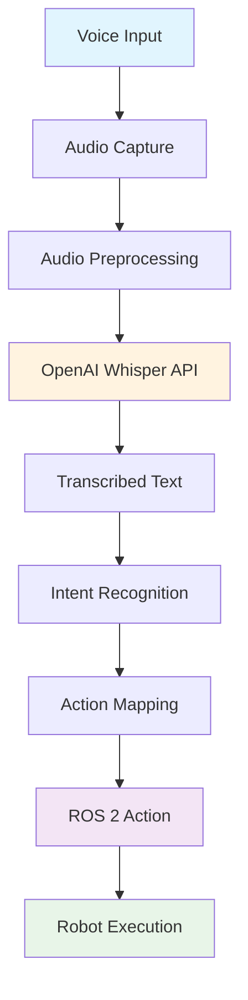

# Voice Command Processing Pipeline

## Pipeline Description

1. **Voice Input**: User speaks command to the robot
2. **Audio Capture**: Microphone captures the audio signal
3. **Audio Preprocessing**: Audio is formatted for API consumption
4. **OpenAI Whisper API**: Converts speech to text
5. **Transcribed Text**: Text representation of the spoken command
6. **Intent Recognition**: Extracts the intended action from text
7. **Action Mapping**: Maps intent to specific robot action
8. **ROS 2 Action**: ROS 2 message containing the action command
9. **Robot Execution**: Robot executes the command in simulation