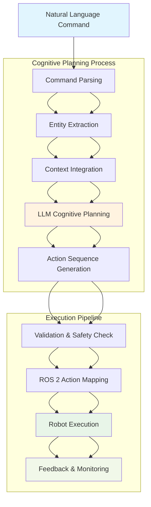

# Natural Language to ROS 2 Action Translation Workflow

## Workflow Description

1. **Natural Language Command**: User provides a command in natural language (e.g., "Go to the kitchen and pick up the red ball")
2. **Command Parsing**: The command is parsed to identify the main intent and components
3. **Entity Extraction**: Objects, locations, and actions are extracted from the command
4. **Context Integration**: The robot's current state and environment information are integrated
5. **LLM Cognitive Planning**: Anthropic Claude processes the command with context to generate a plan
6. **Action Sequence Generation**: A sequence of executable actions is generated
7. **Validation & Safety Check**: The action sequence is validated for safety and feasibility
8. **ROS 2 Action Mapping**: Actions are mapped to specific ROS 2 messages and services
9. **Robot Execution**: The robot executes the action sequence in simulation
10. **Feedback & Monitoring**: Execution results are monitored and feedback is provided